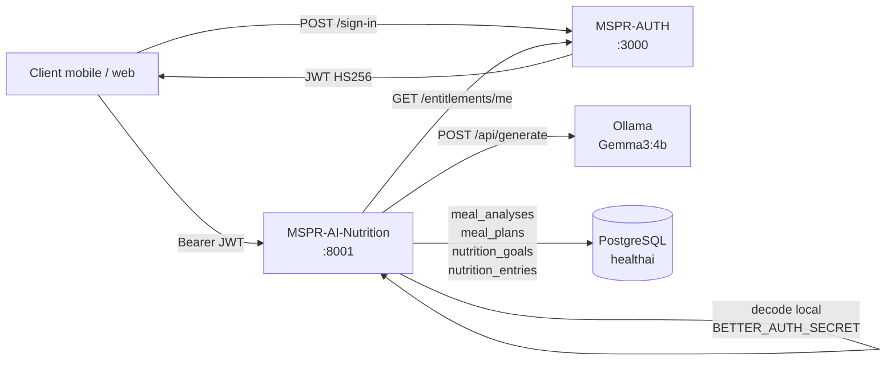

# MSPR-HealthAI-Coach-AI-Nutrition

[](https://github.com/whitefoxxyt/MSPR-HealthAI-Coach-AI-Nutrition/actions/workflows/ci.yml)

Micro-service FastAPI d'analyse nutritionnelle et de generation de plans repas par IA, partie de la plateforme MSPR HealthAI Coach (MSPR2).

Le service fait deux choses :

1. **Analyse de repas** : photo en entree, classification HuggingFace (`nateraw/food`, modele Food-101), lookup nutritionnel sur les datasets ETL, detection de desequilibres macros vs profil utilisateur, et recommandations generees par Ollama (Gemma3:4b) avec fallback matrice statique.
2. **Generation de plans repas** : objectif sante, regime, allergies et budget, prompt structure soumis a Ollama, validation du JSON, persistance du plan sur 1 a 30 jours.

Le PRD complet est l'issue [#15](https://github.com/whitefoxxyt/MSPR-HealthAI-Coach-AI-Nutrition/issues/15).

## Architecture



- Le JWT est decode localement (HS256, secret partage avec MSPR-AUTH). Pas d'aller-retour reseau pour resoudre `user_id`.
- Les entitlements (tier `free` / `premium` / `premium_plus`) sont lus chez MSPR-AUTH avec un cache TTL 60 s pour borner la latence.
- La BDD `healthai` est partagee avec le reste de la plateforme. Les migrations appartiennent a [MSPR-DB](https://github.com/whitefoxxyt/MSPR-HealthAI-Coach-DB) (voir [`data_model.md`](https://github.com/whitefoxxyt/MSPR-HealthAI-Coach-DB/blob/main/docs/data_model.md)).

## Stack

| Composant | Role |
|-----------|------|
| FastAPI 0.115 + Uvicorn | Serveur HTTP, OpenAPI auto |
| HuggingFace Transformers (`nateraw/food`) | Classification d'aliments depuis photo |
| PyTorch 2.7.0 (CPU) | Inference du modele HuggingFace |
| Ollama + Gemma3:4b | Generation des recommandations et plans repas |
| PostgreSQL 17 | Stockage des analyses, plans, profils nutritionnels |
| SQLAlchemy 2.0 | ORM |
| Pydantic v2 + pydantic-settings | Validation des schemas et de la configuration |
| SlowAPI | Rate limiting (10/h, 3/min sur `/generate-meal-plan`) |
| pytest + testcontainers + respx | Tests unitaires, integration et mocks HTTP |

## Demarrage local

```bash
# Service standalone (ne lance pas la plateforme entiere)
cp .env.example .env
docker compose up -d --build

curl http://localhost:8001/health
open http://localhost:8001/docs
```

Pour lancer la stack complete (DB, AUTH, API, FRONT, ce service) :

```bash
cd /home/arthur/Projects/MSPR
docker compose up -d --build
```

Au premier demarrage, Ollama telecharge `gemma3:4b` (~3 Go). Le service repond sur `:8001` mais les recommandations basculent en mode fallback tant que le modele n'est pas pret.

## Variables d'environnement

| Variable | Defaut | Role |
|----------|--------|------|
| `DB_HOST` | `mspr-healthai-db` | Hote PostgreSQL |
| `DB_PORT` | `5432` | Port PostgreSQL |
| `DB_NAME` | `healthai` | Nom de la base |
| `DB_USER` | `healthai_user` | Utilisateur PostgreSQL |
| `DB_PASSWORD` | `password` | Mot de passe PostgreSQL |
| `OLLAMA_HOST` | `http://ollama:11434` | URL du serveur Ollama |
| `BETTER_AUTH_SECRET` | `""` | Secret HS256 partage avec MSPR-AUTH (obligatoire en prod) |
| `AUTH_API_URL` | `http://mspr-healthai-auth:3000` | URL de MSPR-AUTH (entitlements) |

## Endpoints

OpenAPI complet sur `/docs` (Swagger UI) et `/redoc`.

| Methode | Route | Tag | Description |
|---------|-------|-----|-------------|
| GET | `/health` | Sante | Healthcheck (PostgreSQL + Ollama) |
| POST | `/api/v1/analyze-meal` | Analyse | Analyse une photo de repas (macros + recommandations) |
| GET | `/api/v1/meal-analyses/me` | Historique | Historique pagine des analyses |
| POST | `/api/v1/generate-meal-plan` | Plans | Generation d'un plan repas personnalise (1 a 30 jours) |
| GET | `/api/v1/meal-plans/me` | Historique | Historique pagine des plans repas |
| GET | `/api/v1/nutrition-goals/me` | Profil | Lecture du profil nutritionnel |
| PUT | `/api/v1/nutrition-goals/me` | Profil | Creation ou mise a jour du profil nutritionnel (upsert) |

Toutes les routes `/api/v1/*` requierent un header `Authorization: Bearer <jwt>`. Le JWT est emis par MSPR-AUTH (`POST /api/auth/sign-in`).

Codes d'erreur retournes :

- `401` : JWT manquant, malforme ou invalide.
- `404` : profil nutritionnel non encore configure.
- `413` : photo > 10 Mo.
- `415` : type MIME non supporte (utiliser JPEG, PNG, WebP).
- `422` : payload invalide ou image illisible.
- `429` : rate limit depasse (`/generate-meal-plan` : 10/h et 3/min).
- `503` : Ollama et fallback statique tous indisponibles.

### Snapshot OpenAPI versionne

Le contrat est commit en JSON dans `docs/openapi.json` (livrable #6 MSPR2). Regenerer apres toute modification d'un router :

```bash
python scripts/export_openapi.py
```

Le test `tests/test_openapi_doc.py::test_openapi_snapshot_is_up_to_date` echoue tant que le fichier n'est pas synchronise avec le schema courant. Commiter le diff avec la PR qui modifie l'API.

## Tests

Le harnais utilise pytest, testcontainers (PostgreSQL ephemere) et respx (mocks HTTP).

Structure :

```
tests/
├── conftest.py              fixtures partagees (pg_container, db_session, mock_ollama, mock_classifier, valid_jwt)
├── test_openapi_doc.py      verifie la richesse de la doc OpenAPI
├── test_routing.py          smoke tests des prefixes
├── test_meal_analysis_api.py
├── test_meal_analysis_history_api.py
├── test_meal_plan_api.py
├── test_nutrition_goals_api.py
├── unit/                    tests purs (sans IO)
└── slow/                    smoke tests dependances reelles (Ollama, HuggingFace), exclus du CI
```

### Lancer la suite

Conteneur (recommande, isole testcontainers du host) :

```bash
docker compose --profile test build tests
docker compose --profile test run --rm tests          # unit + integration
```

Local (Python 3.12 + Docker pour testcontainers) :

```bash
pip install --extra-index-url https://download.pytorch.org/whl/cpu \
    -r requirements.txt -r requirements-dev.txt
MIGRATIONS_DIR=../MSPR-DB/migrations pytest                # unit + integration
MIGRATIONS_DIR=../MSPR-DB/migrations pytest -m slow        # tests dependances externes
```

Couverture cible : > 80 %. Etat actuel : ~96 %. Rapport HTML genere dans `htmlcov/`.

## Metriques IA

Le PDF MSPR exige des metriques de qualite pour les 2 modeles IA : classifier HuggingFace (`nateraw/food`) et LLM Ollama (`gemma3:4b`). Le rapport complet est dans [`docs/metrics.md`](docs/metrics.md). Le script `scripts/eval_metrics.py` produit `docs/metrics.json` (brut) et `docs/metrics.md` (rendered, avec PNGs).

### Reproduction des metriques

```bash
pip install -r requirements-eval.txt

# Classifier : 1000 images Food-101 + 50 photos terrain (si annotees)
python scripts/eval_metrics.py classifier --n-food101 1000 --seed 42

# LLM : 100 generations + 30 plans contraints + HITL CSV
python scripts/eval_metrics.py llm --n-generations 100 --seed 42
```

Les deux sous-commandes ecrivent dans `docs/metrics.json` (merge) puis re-rendent `docs/metrics.md` complet.

### Datasets HITL

Les annotations humaines sont decouplees du code :

- `data/eval_terrain/labels.csv` : 50 photos terrain. Cf. `data/eval_terrain/README.md`.
- `docs/llm_hitl_ratings.csv` : 20 plans notes 1-5 sur nutrition + originalite + coherence. Cf. `docs/llm_hitl_README.md`.

Sans ces CSV, les sections terrain/HITL sont omises du rapport mais les metriques quantitatives restent calculees.

### Reproductibilite

Seed fixe (`--seed 42` par defaut). Les chiffres restent stables a +/- 5 % d'une execution a l'autre tant que les modeles ne changent pas (HuggingFace `nateraw/food`, Ollama `gemma3:4b`). La temperature LLM est par defaut, donc une variance residuelle persiste sur les latences et la generation.

## Limitations connues

- **Modele Food-101** : 101 classes occidentales, biais de domaine sur les photos prises au telephone (eclairage, angle). Voir `docs/model_benchmark.md`.
- **Inference CPU** : pas de GPU dans cette image. Une analyse prend 1-3 s, une generation LLM 5-30 s.
- **Cache LLM** : 30 jours par hash `(top_label, health_goal, imbalances)` pour `/analyze-meal`, hash inputs pour `/generate-meal-plan`. Les comptes `premium` bypassent le cache.
- **Ollama** : pas de garantie de disponibilite, fallback matrice statique systematique pour `/analyze-meal` et `/generate-meal-plan`.
